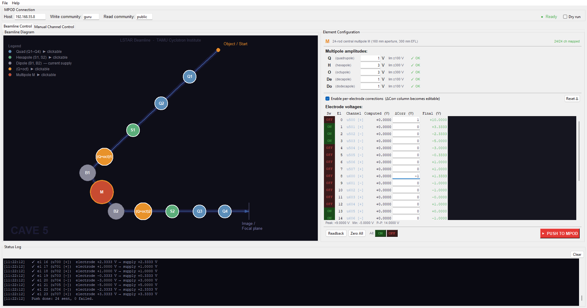
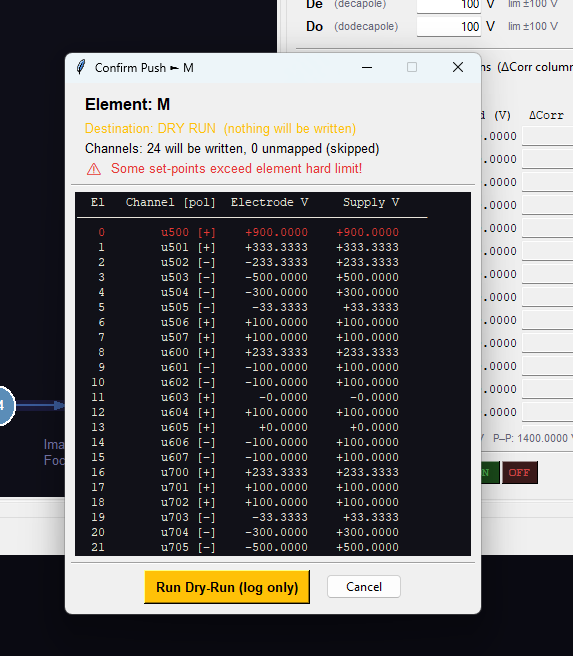
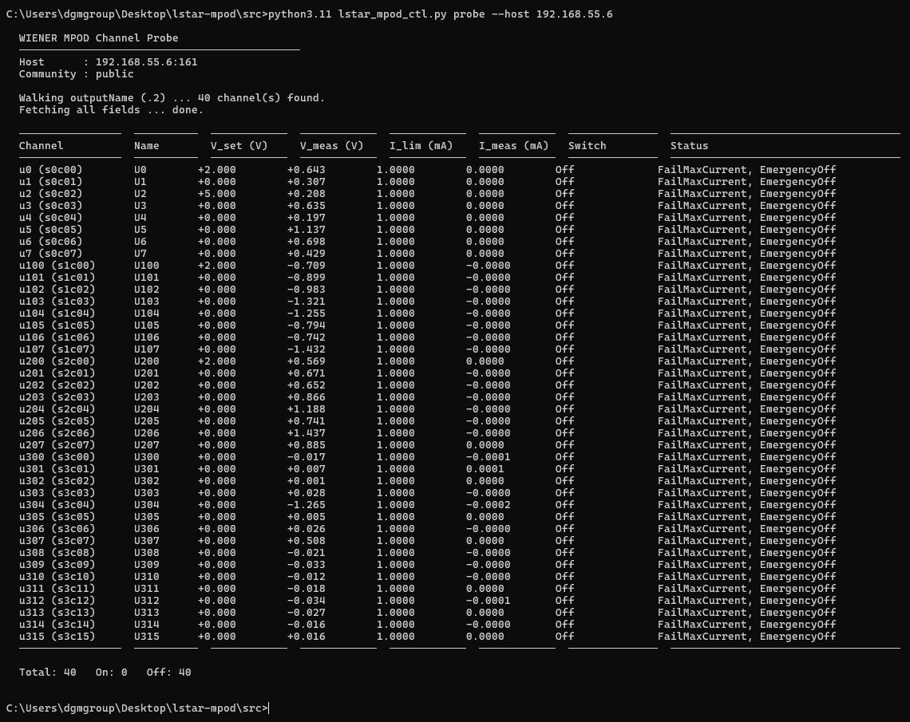
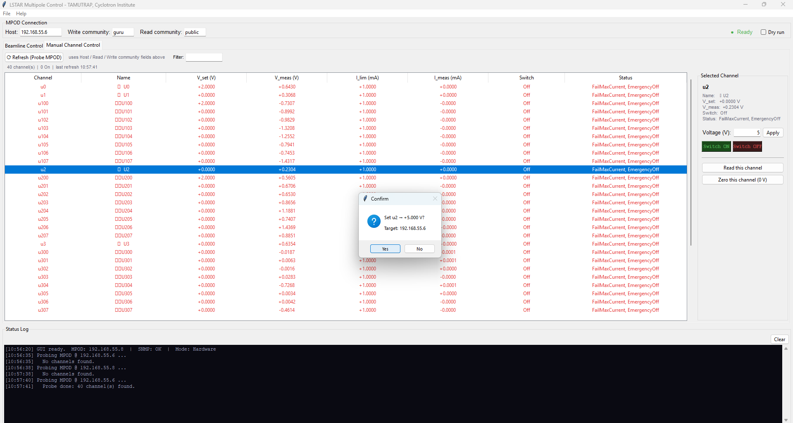

# LSTAR MPOD Control

This is a production control system for the electrostatic multipole electrodes of the **L**ight-ion guide **S**eparator for **T**exas A&M's K150 **R**adioactive beams (LSTAR),
the isobar separator beamline at the Texas A&M Cyclotron Institute, built for
the for the Low-Energy Radioactive ion beam Area (LERA) primarily for TAMUTRAP,
Nuclear Electroweak Properties in Trap Using Near-degenerate Energy states (NEPTUNE)
and laser spectrometer end stations.

TAMUTRAP measures β-ν angular correlations in precision beta decay using a
cylindrical Penning trap, searching for physics beyond the Standard Model with extreme precision. 

To allow for beta decay to even be measured in the first place, the cyclotron creates
a "cocktail" of various, extremely hot ions. These ions get thermalized, and then 
LSTAR's multipole electrodes shape and clean the beam, with a M/ΔM ≥ 5000 achieved by two 62.5° dipole magnets.
Every one of those electrodes is connected to a high-voltage channel on a WIENER MPOD crate that
this project talks to over SNMP.

This repo is both the thing that runs the hardware, and a writeup of how it's built.

## What it actually does

Each LSTAR element is a ring of independently-wired rods (4, 6, or
24 of them, depending on the element) whose *individual* voltages have to be computed
from a much smaller set of physics parameters (quadrupole strength, hexapole
strength, octupole strength, etc.) then pushed out over the network connection to the
correct crate channel, with the correct sign, without exceeding either the
instrument's spec limits or the hardware's absolute ceiling.

```
   physics intent              electrode voltages           network writes
  {Q: 1500, O: -200}   ──>   [+1300, -1700, +1300, ...]  ──>  SNMP SET x 24 channels
```

The project has a CLI (`lstar_mpod_ctl.py`) and a GUI (`lstar_gui.py`) that share
the same underlying physics and safety code, but neither one duplicates the other's
logic.

## Screenshots

The GUI itself:



A push confirmation for a dry run:



A probe using the CLI:



## Why it's organized the way it is

This program uses one formula for every shape. Pure quadrupoles (Q1-Q4, 4 rods), pure
hexapoles (S1/S2, 6 rods), and 24-rod squirrel-cage elements (M, the two
(Q+oct) elements) look like different hardware, but they're all the same underlying
math, a superposition of multipole basis functions evaluated at however many rods
that particular element has.

```python
def triangular_basis(k: int, n: int, N: int) -> float:
    """Normalized triangular-wave coefficient for rod k, multipole order n,
    in a cage of N rods. For a pure quadrupole (n=2, N=4) this reduces to
    the standard [+1,-1,+1,-1] alternating pattern."""
```

`compute_voltages()` calls this once per requested component and sums the result —
so adding a new element to the system is a dictionary entry, not new code.

**Three independent safety checks**

| Layer | Catches |
|---|---|
| `max_amplitude` (From LSTAR spec limits) | Physics-invalid configurations |
| `hard_limit` / `HARD_LIMIT_V` | Hardware damage, independent of whether the physics *looks* fine |
| `_check_voltage_signs()` (polarity preflight) | Sending a negative set-point to a unipolar module, which the crate will simply reject, but only *after* you've already started writing |

The polarity check exists because the crate may be a mix of bipolar iseg HV modules and
unipolar 0MPV LV modules. The channel map abstracts this with a per-electrode
*polarity factor*: `v_set = v_electrode × polarity_factor`. A channel map entry is
either `'u700'` (shorthand for `+1`) or `('u700', -1)` for an electrode physically
wired to a module's U− terminal. This means the multipole math never has to know
which kind of module it's ultimately writing to, and all can be taken of during initial wiring.

**The GUI degrades gracefully.** If `puresnmp` isn't installed or `lstar_mpod_ctl`
can't be imported, `lstar_gui.py` falls back to stub physics/SNMP functions and
keeps running in diagram-only / dry-run mode. You can open the beamline diagram and
click through every element with zero hardware dependencies,which is useful for
demonstrating the tool, and for anyone reviewing the design without lab access. 
Even without the same lab setup, if libraries and dependencies *are* installed the 
GUI can be used to probe other MPODs, read, write, and switch any available channels 
on/off using the crate's IP.



**Every hardware-affecting action is logged.** Pushes, zeroes, and channel
on/off switches write an append-only line to a changelog (who, what, when, before
state, result), making a basic audit trail for a system that's writing real voltages to
real electrodes. See [a sample changelog](examples/sample_changelog.log).

## How it got here

The CLI and GUI are the current, consolidated tools, but the repo keeps the
earlier scripts in `scripts/`, because they're the actual development path,
being the stepping stones to the final result. For anyone trying to reverse
engineer or set up a similar system, they can probably prove a strong starting point.

`sysDescr.py` (does the crate even respond to SNMP?) →
`wiener_crate_walk.py` (what's actually on this crate?) →
`mpod_probe.py` / `mpod_diagnose.py` / `mpod_write_test.py` (read, diagnose, write
one channel safely) → `lstar_mpod_ctl.py` (unify all of that behind one CLI with
real physics and real safety limits) → `lstar_gui.py` (put a beamline diagram on
top of it).

Each of the early scripts is still a legitimate, independent tool, and `mpod_diagnose.py`
in particular is the first thing to reach for if the crate looks unresponsive.

## Getting started

```bash
git clone https://github.com/almondshawarma/LSTAR-MPOD-control
cd lstar-mpod-control
python -m venv .venv && source .venv/bin/activate   # Windows: .venv\Scripts\activate
pip install -r requirements.txt

# Always safe, read-only
python src/lstar_mpod_ctl.py probe

# See the beamline diagram with no hardware connection required
python src/lstar_gui.py --dry-run
```

A full command reference, the channel-map format, and lab operating procedure can be found in
in [`docs/MANUAL.md`](docs/MANUAL.md).

## Stack

Python 3.11+ · [`puresnmp`](https://github.com/exhuma/puresnmp) (SNMPv2c) ·
NumPy · Tkinter (GUI)

## Acknowledgments

Built for the TAMUTRAP collaboration at the Texas A&M University Cyclotron
Institute, under Dr. Dan Melconian. This material is based upon work supported
by the U.S. Department of Energy, Office of Science under Awards Number
DE-SC0022469 and DE-FG02-93ER40773.

## License

See [`LICENSE`](LICENSE).

## Contact

Questions or issues: open a GitHub issue, or reach out at amansharma@tamu.edu.
